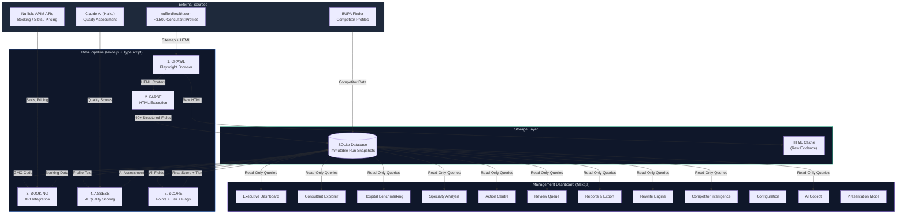
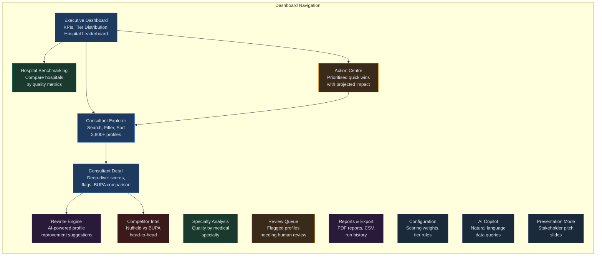
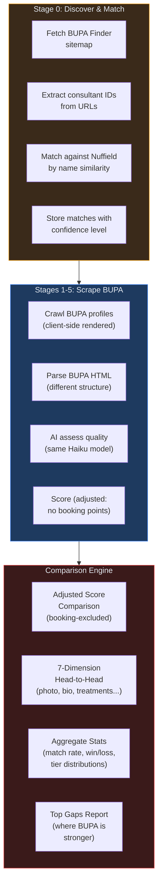
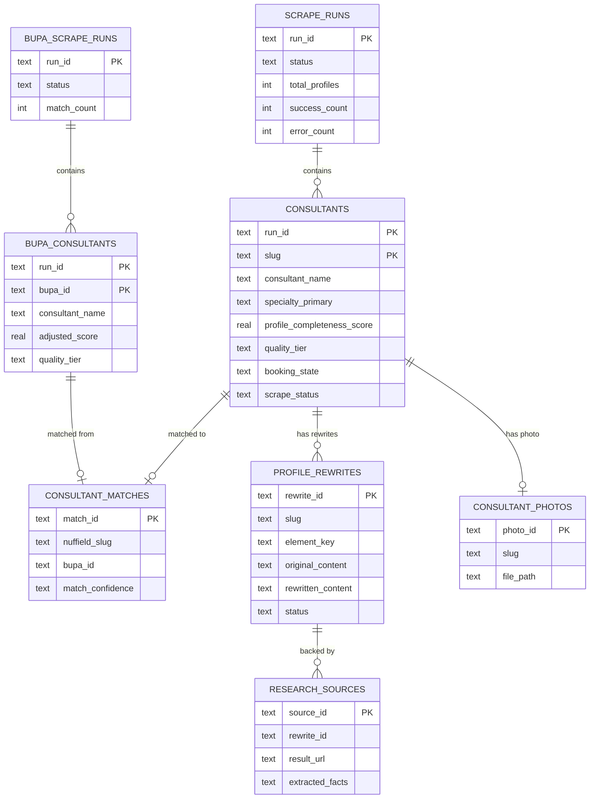
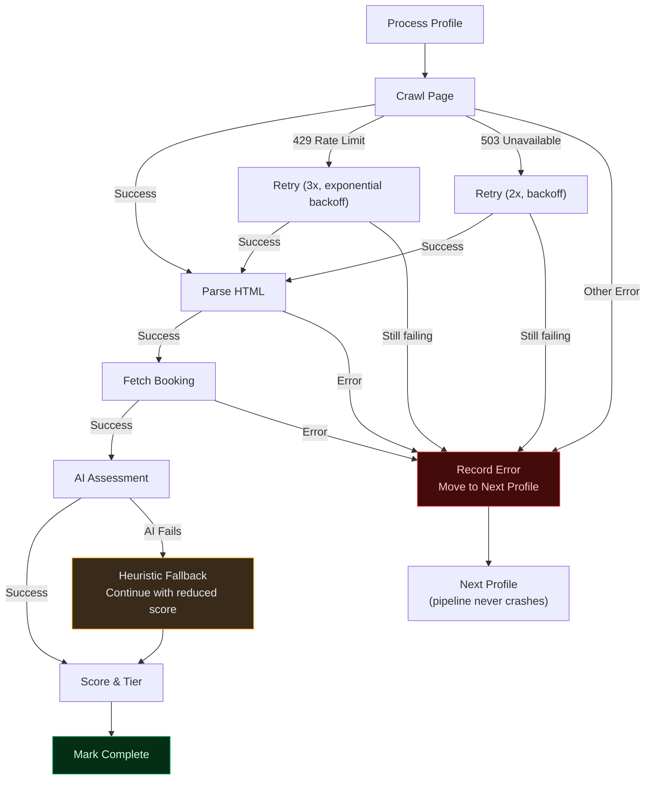
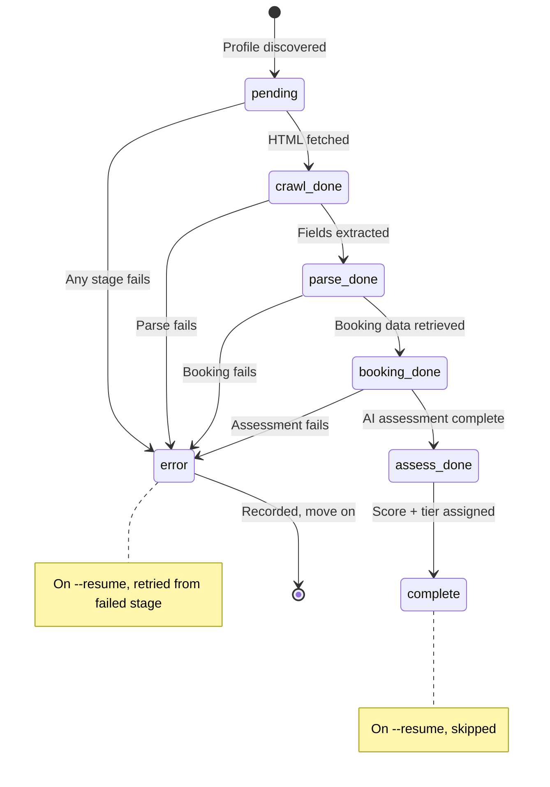

# Consultant Intelligence Platform — System Architecture Map

> **Audience:** Leadership & Stakeholders
> **Author:** Mary (Business Analyst, BMAD)
> **Date:** 2026-03-07
> **Version:** 1.0

---

## Executive Summary

Cambrian Solutions has built a **Consultant Intelligence Platform** for Nuffield Health that automatically audits the quality of ~3,800 consultant profiles across the entire nuffieldhealth.com estate. It scrapes every profile, retrieves live booking data, uses AI to assess content quality, scores each profile on a 100-point scale, and presents everything through an interactive management dashboard with actionable recommendations.

**The core question it answers:** *"How good are our consultant profiles, where are the gaps, and what should we fix first?"*

---

## 1. The "Why" — Business Problem & Value

### The Problem

Nuffield Health has ~3,800 consultant profiles on their website. These profiles are the primary way patients discover and choose consultants. But:

- **Nobody knows the overall quality** — there's no systematic way to audit 3,800 profiles
- **Inconsistent content** — some profiles are Gold-standard (photo, detailed bio, booking), others are near-empty
- **No visibility into booking** — which consultants are actually bookable online? What's their availability?
- **No competitor benchmark** — how do Nuffield profiles compare to the same consultants on BUPA?
- **Manual review is impossible** — reviewing 3,800 profiles by hand would take months

### The Solution

An automated pipeline that:

1. **Reads every profile** on the website (like a very thorough auditor)
2. **Checks booking availability** via Nuffield's own APIs
3. **Uses AI to assess quality** (is the bio well-written? are treatments specific?)
4. **Scores and ranks** every profile on a consistent 100-point scale
5. **Presents it all** in a dashboard with filters, benchmarks, and prioritised actions
6. **Compares against BUPA** to identify competitive gaps

### The Value

| Metric | What It Means |
|--------|--------------|
| **Avg Profile Score** | Network-wide quality benchmark — track improvement over time |
| **Gold Tier %** | How many profiles meet the highest standard |
| **Action Centre** | Prioritised list of quick wins — "add photos to these 400 profiles for +10 points each" |
| **Competitive Gaps** | Specific consultants where BUPA's profile is stronger than Nuffield's |
| **Booking Intelligence** | Which consultants are bookable, availability, pricing |

---

## 2. System Architecture — The Big Picture



---

## 3. Data Pipeline — How It Works (Step by Step)


### What Each Stage Does & Why

| Stage | What | Why | Output |
|-------|------|-----|--------|
| **CRAWL** | Visits every consultant page using a real browser (Playwright) | Many profiles have dynamic content (JS-rendered sections, "View more" buttons) that simple HTTP requests miss | Raw HTML files cached to disk |
| **PARSE** | Extracts 40+ structured fields from the HTML | Turns unstructured web pages into a consistent, queryable dataset | Name, specialty, bio, treatments, qualifications, insurers, hospital, contact info, etc. |
| **BOOKING** | Calls Nuffield's own booking APIs to check availability | Answers "can a patient actually book this consultant online?" | Available slots, next date, consultation price, booking state |
| **AI ASSESS** | Sends profile text to Claude AI for quality assessment | Human-like quality judgement at scale — is the bio well-written? Are treatments specific? | Plain English score (1-5), bio depth, treatment specificity, qualifications completeness |
| **SCORE** | Applies a 100-point scoring formula with configurable weights | Consistent, fair ranking across all 3,800 profiles | Final score, quality tier (Gold/Silver/Bronze/Incomplete), improvement flags |

---

## 4. Scoring System — How Profiles Are Rated

```mermaid
graph LR
    subgraph DIMENSIONS["11 Scoring Dimensions (100 points total)"]
        D1["Photo<br/>10 pts"]
        D2["Bio Depth<br/>15 pts"]
        D3["Treatments<br/>10 pts"]
        D4["Qualifications<br/>10 pts"]
        D5["Specialty<br/>10 pts"]
        D6["Insurers<br/>8 pts"]
        D7["Clinic Times<br/>7 pts"]
        D8["Plain English<br/>10 pts"]
        D9["Booking<br/>10 pts"]
        D10["Experience<br/>5 pts"]
        D11["Memberships<br/>5 pts"]
    end

    subgraph TIERS["Quality Tiers"]
        GOLD["GOLD<br/>80+ pts<br/>Photo + Substantive Bio<br/>+ Specialty Evidence"]
        SILVER["SILVER<br/>60+ pts<br/>Photo + Specialty"]
        BRONZE["BRONZE<br/>40+ pts<br/>Specialty"]
        INC["INCOMPLETE<br/>Below 40<br/>or 2+ fail flags"]
    end

    DIMENSIONS --> TIERS

    style GOLD fill:#854d0e,stroke:#fbbf24,color:#fef3c7
    style SILVER fill:#374151,stroke:#9ca3af,color:#e5e7eb
    style BRONZE fill:#7c2d12,stroke:#ea580c,color:#fed7aa
    style INC fill:#450a0a,stroke:#ef4444,color:#fecaca
```



### Tier Gates (Why Score Alone Isn't Enough)

A consultant can score 85 points but still NOT get Gold tier if they're missing a mandatory field. This prevents "gaming" the score with lots of minor fields while lacking essentials:

- **Gold requires:** Photo AND substantive bio AND specialty evidence
- **Silver requires:** Photo AND specialty evidence
- **Bronze requires:** Specialty evidence
- **Any 2+ fail-severity flags** forces Incomplete regardless of score

### Why Configurable?

The scoring weights, tier thresholds, and gate rules are all editable from the Configuration page. This lets Nuffield's team adjust priorities without code changes — e.g., "we care more about booking availability than memberships."

---

## 5. Dashboard Pages — What Each Screen Does



### Page Purpose Summary

| Page | Who Uses It | What Question It Answers |
|------|-------------|------------------------|
| **Executive Dashboard** | Leadership | "What's the overall state of our consultant profiles?" |
| **Consultant Explorer** | Content teams, operations | "Find me all Bronze-tier orthopaedic surgeons missing photos" |
| **Consultant Detail** | Content editors | "What specifically needs improving on Dr Smith's profile?" |
| **Hospital Benchmarking** | Regional managers | "How does London Bridge compare to Manchester?" |
| **Specialty Analysis** | Clinical teams | "Are our cardiology profiles better than dermatology?" |
| **Action Centre** | Content leads | "What's the single highest-impact improvement we can make?" |
| **Review Queue** | QA team | "Which profiles have data quality issues needing human eyes?" |
| **Reports & Export** | Leadership, analysts | "Give me a PDF report for the board / a CSV for analysis" |
| **Rewrite Engine** | Content writers | "AI-suggest an improved bio for this consultant" |
| **Competitor Intel** | Strategy | "Where is BUPA beating us on profile quality?" |
| **Configuration** | Platform admin | "Adjust scoring weights and tier requirements" |
| **AI Copilot** | Anyone | "Ask natural language questions about the data" |
| **Presentation** | Sales / pitches | "Full-screen stakeholder presentation" |

---

## 6. BUPA Competitor Intelligence — How Comparison Works



### Why Adjusted Scores?

BUPA doesn't have the same booking API, so we can't compare booking availability. The comparison engine removes booking points from both sides and re-normalises to 100, giving a fair apples-to-apples comparison on profile content quality.

### 7 Comparison Dimensions

| Dimension | What's Compared | Winner Criteria |
|-----------|----------------|-----------------|
| Photo | Has profile photo? | Yes beats No |
| Bio Depth | substantive > adequate > thin > missing | Higher rank wins |
| Treatments | Count of listed treatments | More wins |
| Qualifications | Present vs absent | Present wins |
| Specialties | Count of listed specialties | More wins |
| Plain English | AI readability score (1-5) | Higher wins |
| Memberships | Count of professional memberships | More wins |

---

## 7. Data Model — How Information Is Stored



### Key Design Decision: Immutable Run Snapshots

Every time the pipeline runs, it creates a new `run_id`. All ~3,800 consultant records are keyed by `(run_id, slug)`. This means:

- **Historical comparison** — compare this month's scores to last month's
- **Audit trail** — every data point traceable to a specific pipeline execution
- **Safe re-runs** — new runs never overwrite previous data
- **Resume capability** — interrupted runs can pick up exactly where they stopped

---

## 8. Technology Decisions — Why We Built It This Way

| Decision | What We Chose | Why |
|----------|--------------|-----|
| **Browser-based scraping** | Playwright | Profiles have JS-rendered content, expandable sections, and iframes. Simple HTTP requests miss ~30% of content |
| **Heading-based parsing** | Match by text, not DOM position | The same section appears as H2, H3, or H4 across different profiles. Position-based parsing breaks on ~15% of profiles |
| **Claude Haiku for AI** | Not Sonnet/Opus | Quality assessment is structured scoring (1-5 scales, enums). Haiku is 3-4x cheaper (~$17 per full run) and fast enough for 3,800 sequential calls |
| **SQLite database** | Not Postgres/MySQL | Zero-config, single-file, perfect for a single-user tool. Immutable snapshots fit naturally. Future: Turso (hosted SQLite) for Vercel deployment |
| **Next.js Server Components** | No API layer | Dashboard queries the database directly — no unnecessary middleware for a single-user internal tool |
| **Configurable scoring** | JSON config file | Business can adjust weights and rules without code changes or developer involvement |
| **Immutable run snapshots** | Never overwrite data | Auditability, historical comparison, safe resume/retry |
| **Two-layer assessment** | Deterministic parse + AI quality | Layer 1 is repeatable and auditable. Layer 2 adds human-like judgement. If AI fails, pipeline continues with heuristic fallbacks |

---

## 9. Error Handling & Resilience



**Key principle:** The pipeline **never crashes**. Every error is caught, recorded, and the system moves to the next profile. A full run of 3,800 profiles completes without manual intervention.

---

## 10. Resume & Recovery



When a run is interrupted (crash, network loss, etc.), running with `--resume` picks up exactly where it left off — profiles already completed are skipped, and failed profiles are retried from the stage that failed.

---

## 11. What We've Built — Feature Summary

### Data Pipeline
- Full-estate scraper covering ~3,800 consultant profiles
- Live booking availability and pricing from Nuffield APIM APIs
- AI quality assessment using Claude Haiku (bio quality, readability, specificity)
- 100-point configurable scoring with 4 quality tiers
- BUPA competitor scraper with name-matching and head-to-head comparison
- Resume/retry capability for interrupted runs
- Raw HTML evidence cache for auditability

### Management Dashboard (12 pages)
- Executive dashboard with KPIs, tier distribution, hospital leaderboard
- Consultant explorer with 15+ filters, sorting, pagination, batch operations
- Individual consultant deep-dive with score breakdown and BUPA comparison
- Hospital benchmarking across all Nuffield sites
- Specialty analysis across all medical specialties
- Prioritised Action Centre with projected impact calculations
- Review queue for flagged profiles needing human attention
- PDF report generation and CSV export (with contact data governance)
- AI-powered profile rewrite engine with web research backing
- Competitive intelligence dashboard (Nuffield vs BUPA)
- Configurable scoring controls
- AI copilot for natural language queries
- Full-screen presentation mode for stakeholder pitches

### Quality Assurance
- 174 automated unit tests
- 15 bugs found and fixed across 3 QA phases
- 200-profile stress test passed with zero crashes
- 40-profile ground truth validation (30 cohort + 10 random)

---

## 12. How to Use the Diagrams

All diagrams above use **Mermaid** syntax. To render them:

1. **GitHub** — Push this file to the repo; GitHub renders Mermaid natively in markdown
2. **Mermaid Live Editor** — Paste any diagram block into [mermaid.live](https://mermaid.live) to get PNG/SVG/PDF
3. **Notion** — Use a Mermaid code block (supported natively)
4. **VS Code** — Install "Markdown Preview Mermaid Support" extension
5. **Confluence** — Use the Mermaid macro or paste rendered images

---

## Appendix A: File Structure

```
nuffieldHealth/
  _bmad-output/                    # Planning artifacts & specs
    planning-artifacts/
      quick-spec-*.md              # Requirements (source of truth)
      architecture.md              # Technical architecture decisions
      project-status.md            # Live project tracker
    implementation-artifacts/
      bug-reports/                 # BUG-001 through BUG-015
      test-results/                # QA phase results

  nuffield-health/                 # Application code
    src/
      scraper/                     # Data pipeline
        run.ts                     #   Pipeline orchestrator
        crawl.ts                   #   Playwright web scraper
        parse.ts                   #   HTML parser (40+ fields)
        booking.ts                 #   APIM booking API client
        assess.ts                  #   Claude AI quality assessment
        score.ts                   #   Scoring engine + tier assignment
        headings.ts                #   Heading classification dictionary
        bupa/                      #   BUPA competitor pipeline
          run-bupa.ts              #     BUPA pipeline orchestrator
          discover-bupa.ts         #     Name matching engine
          crawl-bupa.ts            #     BUPA page scraper
          parse-bupa.ts            #     BUPA HTML parser

      db/                          # Database layer
        schema.ts                  #   Drizzle ORM schema (7 tables)
        index.ts                   #   DB connection (SQLite/Turso)
        queries.ts                 #   Dashboard queries (32 functions)
        bupa-queries.ts            #   BUPA comparison queries

      app/                         # Next.js dashboard (12 pages)
        page.tsx                   #   Executive Dashboard
        consultants/page.tsx       #   Consultant Explorer
        consultants/[slug]/        #   Consultant Detail
        hospitals/page.tsx         #   Hospital Benchmarking
        specialties/page.tsx       #   Specialty Analysis
        actions/page.tsx           #   Action Centre
        review/                    #   Review Queue
        reports/page.tsx           #   Reports & Export
        rewrite/page.tsx           #   Rewrite Engine
        competitor/page.tsx        #   Competitor Intelligence
        configuration/page.tsx     #   Scoring Configuration
        presentation/page.tsx      #   Presentation Mode

      lib/                         # Shared utilities
        config.ts                  #   Environment vars & constants
        errors.ts                  #   Error type hierarchy
        scoring-config.ts          #   Configurable scoring I/O
        validators.ts              #   Zod validation schemas
        types.ts                   #   Shared TypeScript types

      components/                  # UI components
        ui/                        #   shadcn/ui primitives
        dashboard/                 #   Dashboard-specific components

    data/                          # Runtime data (gitignored)
      nuffield.db                  #   SQLite database
      html-cache/                  #   Cached profile HTML
      bupa-html-cache/             #   Cached BUPA HTML
      scoring-config.json          #   User-editable scoring config

    drizzle/                       # Database migrations
      0000_great_mephisto.sql      #   Initial schema
      0001_yummy_martin_li.sql     #   AI evidence fields
      0002_pale_power_man.sql      #   BUPA + rewrite engine
```

---

## Appendix B: Key Metrics from Testing

| Metric | Result |
|--------|--------|
| Total profiles scraped | ~3,814 |
| Fields extracted per profile | 40+ |
| Automated tests | 174 passing |
| Bugs found & fixed | 15 |
| Stress test (200 profiles) | 200/200 success, 0 crashes |
| AI assessment cost per full run | ~$17 |
| Scoring dimensions | 11 (configurable weights) |
| Quality tiers | 4 (Gold, Silver, Bronze, Incomplete) |
| Dashboard pages | 12 |
| BUPA comparison dimensions | 7 |
